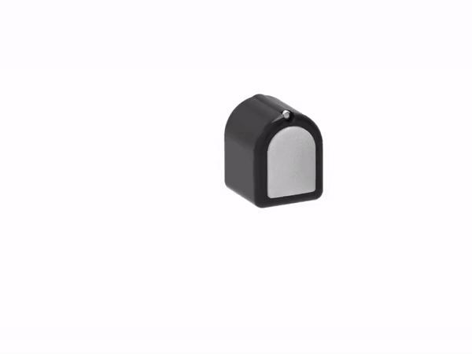

***
September 2023: We are happy to announce a DIGIT Call for Proposal, more information at [https://digit.ml/cfp](https://digit.ml/cfp)
***

  

### What is DIGIT?

DIGIT is an easy-to-use, reliable, low-cost, compact, high-resolution, tactile sensor designed for robotic in-hand manipulation.
The [sensor is open-source](https://github.com/facebookresearch/digit-design) so that everyone can build one.
More information about DIGIT can be found in [our paper](https://arxiv.org/abs/2005.14679) or by playing the video below.

<iframe width="800" height="450" src="https://www.youtube-nocookie.com/embed/F73kkqiHGwE" frameborder="0" allow="accelerometer; autoplay; encrypted-media; gyroscope; picture-in-picture" allowfullscreen></iframe>

### How do I use DIGIT?

DIGIT is designed to be easy to connect and use -- DIGIT is equipped with a standard USB-3 port, and its [drivers/interface is available here](https://github.com/facebookresearch/digit-interface).

### Can I buy a DIGIT?

We understand that for many people might be difficult and time-consuming to manifacture a sensor themself.
For this reason, we have partnered with [GelSight Inc.](https://gelsight.com/) to commercialize DIGIT.
Fully assembled sensors can be easily bought from their [online store](https://gelsight.com/product/digit-tactile-sensor/).

### On what robots can DIGIT be mounted?

DIGIT is designed to be natively compatible with the [Wonik's Allegro Hand](http://wiki.wonikrobotics.com/AllegroHandWiki/index.php/Allegro_Hand).
In addition, we [provide files](https://github.com/facebookresearch/digit-design/tree/master/adaptors) for 3d-printable adaptors for mounting DIGIT on several common robotic platforms.

  
  
  
   
  

### Is there a simulator for DIGIT? 

Yes! An open-source simulator for DIGIT is available at [https://github.com/facebookresearch/tacto](https://github.com/facebookresearch/tacto).

### Can I use Machine Learning with DIGIT?

Yes! DIGIT is natively supported by the [PyTouch open-source library for touch processing](https://github.com/facebookresearch/pytouch).

